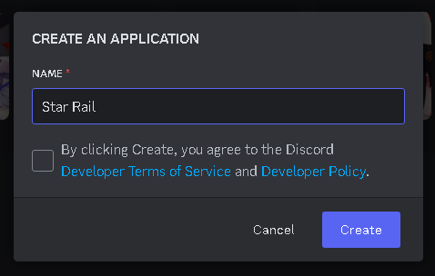
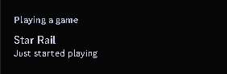
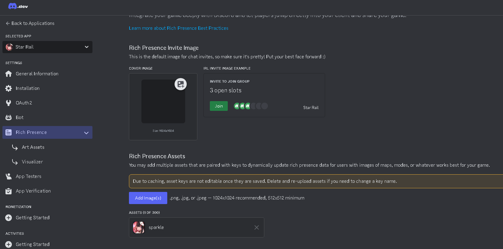
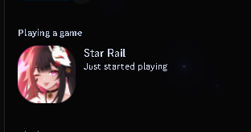
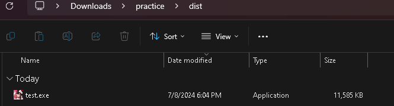

# Custom Playing Status for Open Application

Easily customize your Discord playing status with an image.

## Download Python and Visual Studio Code

1. [Download Python](https://www.python.org/downloads/) or [Install Python from the Microsoft Store](https://www.microsoft.com/store/productId/9NRWMJP3717K?ocid=pdpshare)
2. [Add Python to PATH](https://www.mygreatlearning.com/blog/add-python-to-path/)
3. [Download Visual Studio Code](https://code.visualstudio.com/download)
4. [CustomStatusDiscord.zip](https://github.com/DragoonT/Custom-Status-for-Open-Application/releases)

## How to Install

1. Open Command Prompt and navigate to your desired directory:
    ```bash
    cd your/path
    ```

2. Clone the repository:
    ```bash
    git clone https://github.com/DragoonT/Custom-Status-for-Open-Application.git your_folder_name
    ```
    Or download the [Custom-Status-for-Open-Application.zip](https://github.com/DragoonT/Custom-Status-for-Open-Application/archive/refs/heads/main.zip) to your PC and extract it.

3. Go to the [Discord Developer Portal](https://discord.com/developers/applications) and create a new application (Create Bot Discord).
    

4. Click your new application and go to **General Information** to get the **APPLICATION ID** (Client ID) and **Bot** section to get the **TOKEN**.

5. (Optional) To change your bot name, go to **General Information** and edit the bot name for the status to show "Playing your_bot_name".

6. Open `your_file.py` (e.g., `test.py`) and paste **TOKEN**, **CLIENT ID**, **EXECUTABLE_NAME**, yourapplication.exe, and **small_image**.

7. In Visual Studio Code, open the terminal and navigate to your project directory:
    ```bash
    cd path/to/your_folder_name
    ```
    If your folder name is `Custom_Playing_Status_for_Open_Application`, use:
    ```bash
    cd path/to/Custom_Playing_Status_for_Open_Application
    ```

8. Follow the steps in `howtoactivate.txt` or continue with these steps.

9. Install required Python packages:
    ```bash
    pip install discord.py psutil pypresence pillow
    ```

10. Run your script:
    ```bash
    python your_file.py
    ```

11. If the above step fails, follow these commands:
    ```bash
    python -m venv myenv
    myenv\Scripts\activate
    pip install discord.py psutil pypresence pillow
    python your_file.py
    ```

12. Open your application and check the playing status.

    

## Adding an Image to Your Playing Status

1. Stop the script using Ctrl + C or close the terminal.

2. Add your image to your project folder.

3. Open `cropimage.py` (or rename this file) and set `image_path` to your image's path and `output_path` for the cropped image.

4. Go to the [Discord Developer Portal](https://discord.com/developers/applications) and navigate to **Rich Presence** > **Rich Presence Assets**. Click **Add Image(s)** to upload your cropped image and copy the image name to `small_image="YourRichPresenceAssets"` in `your_file.py`.

    

5. If you need to re-upload the image, wait 10-15 minutes and reload the website.

6. Run your script again to see the updated playing status:
    ```bash
    python your_file.py
    ```

    

## How to Create and Run the Executable

1. Follow the steps in `howtoactivate.txt` or continue with these steps.

2. Open the terminal, navigate to your project directory, and install PyInstaller:
    ```bash
    pip install pyinstaller
    ```

3. Add your `your_icon.ico` file to your project directory.

4. To create the executable, run:
    ```bash
    pyinstaller --onefile --icon=your_icon.ico your_file.py
    ```
    To create the executable without showing the console, run:
    ```bash
    pyinstaller --onefile --icon=your_icon.ico --noconsole your_file.py
    ```

5. Go to the `dist` directory to find your executable.

    
